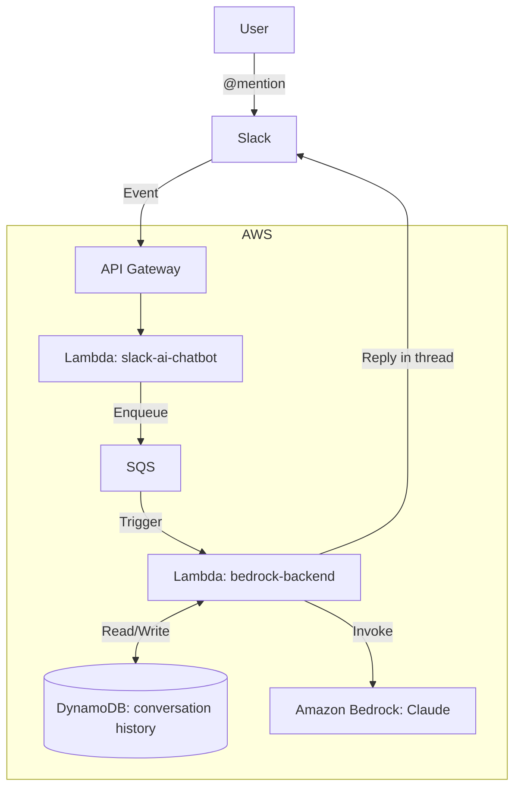

# bedrock-slack-ai-chatbot
A Slack AI chatbot application using Amazon Bedrock with thread-based conversation history.

Functions as an HTTP API server using API Gateway.
***
This Project was created with reference to the following:
[Amazon BedrockとSlackで生成AIチャットボットアプリを作る (その2：Lambda＋API Gatewayで動かす)](https://dev.classmethod.jp/articles/amazon-bedrock-slack-chat-bot-part2/)

### Architecture Diagram


***
### Resources Created
When you Terraform Apply this project, it creates the resources and configurations within the 'AWS Cloud' shown in the architecture diagram.
 - API Gateway
 - Lambda Layer
 - Lambda Function
 - Bedrock
 - SQS
 - DynamoDB (conversation history)

For the variables SLACK_BOT_TOKEN / SLACK_SIGNING_SECRET, use the values from your own Slack App.
***
## How To Use

**Mention @app_name to start a conversation.**

The bot replies in-thread and remembers the conversation context within that thread. Mention @app_name again in the same thread to continue the conversation.

```
You:  @bot Pythonのリスト内包表記って何？
Bot:  [スレッドに返信] リスト内包表記は...

You:  (スレッド内) @bot じゃあ辞書版は？
Bot:  (スレッド内) 辞書内包表記は...  ← 前の文脈を踏まえて回答
```

Conversation history is stored per thread in DynamoDB and automatically expires after 7 days.

***
## Installation Guide

### Prerequisites
- Terraform installed on your local machine
- AWS CLI configured with appropriate credentials
- A Slack app created with bot token and signing secret

### Steps

1. Clone the repository to your local machine.

2. Navigate to the project directory.

3. Set up Terraform variables:
 - Option A: set variable in HCP Terraform

   ```hcl
   slack_bot_token      = "your-slack-bot-token"
   slack_signing_secret = "your-slack-signing-secret"
   ```
 - Option B: Local environment, e.g., Ubuntu
  
   first, Open variables.tf and change the variable names to uppercase

   then add env var
   
   ```bash
   export SLACK_BOT_TOKEN="your-slack-bot-token"
   export SLACK_SIGNING_SECRET="your-slack-signing-secret"
   ```

    Replace your-slack-bot-token and your-slack-signing-secret with your actual Slack App values.

4. Initialize Terraform:
   ```
   terraform init
   ```

5. Apply the Terraform configuration:
   ```
   terraform apply
   ```

   Review the planned changes and type `yes` when prompted to create the resources.

6. After the apply is complete, note the API Gateway endpoint URL in the Terraform output.

7. Configure Slack:
   - Go to your Slack App's configuration page
   - Navigate to "Event Subscriptions"
   - Enable events
   - In the "Request URL" field, enter: `{your-api-endpoint}/slack/events`
     Replace `{your-api-endpoint}` with the actual API Gateway endpoint URL from step 6.

8. Save the Slack App configuration.

Your Slack AI chatbot should now be ready to use!
